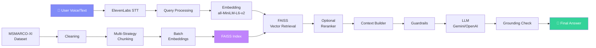

# Voice-RAG Assistant

A production-quality **voice-enabled Retrieval-Augmented Generation (RAG)** system built with the [MSMARCO-XI](https://huggingface.co/datasets/ai4bharat/MSMARCO-XI) dataset.

## Architecture



## Features

- **Voice Input**: ElevenLabs Speech-to-Text (Scribe)
- **Multi-Strategy Chunking**: Fixed-size, sentence-aware, semantic, metadata-aware
- **Hybrid Retrieval**: Dense (FAISS) + BM25 with Reciprocal Rank Fusion
- **Optional Reranking**: Cross-encoder (ms-marco-MiniLM-L-6-v2)
- **Grounded Generation**: Gemini 2.0 Flash or OpenAI via clean abstraction
- **Guardrails**: Safety filtering, relevance checking, grounding validation
- **Latency Tracking**: Per-component timing with P50/P70/P100 reporting
- **Embedding Cache**: LRU cache for repeated query embeddings
- **Premium Web UI**: Dark glassmorphism design with real-time results

## Dataset

[ai4bharat/MSMARCO-XI](https://huggingface.co/datasets/ai4bharat/MSMARCO-XI) — MS MARCO translated into Indic languages. We use the **English passages** subset for the RAG knowledge base.

## Quick Start

### 1. Installation

```bash
cd voice-rag
python -m venv venv
venv\Scripts\activate        # Windows
# source venv/bin/activate   # Linux/Mac

pip install -r requirements.txt
```

### 2. Environment Variables

```bash
copy .env.example .env
# Edit .env and add your API keys:
#   ELEVENLABS_API_KEY=your_key
#   GEMINI_API_KEY=your_key
```

### 3. Download & Prepare Dataset

```bash
python scripts/download_dataset.py
python scripts/prepare_dataset.py
```

### 4. Build Vector Index

```bash
python scripts/build_index.py
```

### 5. Start Backend

```bash
uvicorn app.main:app --host 0.0.0.0 --port 8000 --reload
```

### 6. Open Frontend

Navigate to [http://localhost:8000](http://localhost:8000)

### 7. Run Tests

```bash
python -m pytest tests/ -v
```

### 8. Run Latency Evaluation

```bash
python scripts/evaluate_latency.py
```

### 9. Run Demo Mode (No Microphone)

```bash
python scripts/run_demo.py
```

### 10. Pre-Submission Check

```bash
python scripts/pre_submission_check.py
```

## Environment Variables

| Variable | Default | Description |
|----------|---------|-------------|
| `ELEVENLABS_API_KEY` | — | ElevenLabs API key for STT/TTS |
| `GEMINI_API_KEY` | — | Google Gemini API key |
| `LLM_PROVIDER` | `gemini` | `gemini` or `openai` |
| `EMBEDDING_MODEL` | `sentence-transformers/all-MiniLM-L6-v2` | Sentence transformer model |
| `CHUNKING_STRATEGY` | `sentence` | `fixed`, `sentence`, `semantic`, `metadata` |
| `RETRIEVAL_MODE` | `hybrid` | `dense`, `bm25`, `hybrid` |
| `TOP_K` | `5` | Number of passages to retrieve |
| `USE_RERANKER` | `false` | Enable cross-encoder reranking |
| `GUARDRAILS_ENABLED` | `true` | Enable safety/relevance checks |
| `DATASET_MAX_ROWS` | `5000` | Max rows to process from dataset |

## Chunking Strategies

| Strategy | Description | Best For |
|----------|-------------|----------|
| **sentence** | Splits on sentence boundaries, groups to budget | General use (default) |
| **fixed** | Fixed character windows with overlap | Uniform chunk sizes |
| **semantic** | Groups by embedding similarity | Coherent topic chunks |
| **metadata** | Preserves passage boundaries | Structured documents |

## Retrieval Architecture

1. **Dense retrieval**: Query embedded → FAISS cosine search → top-K candidates
2. **BM25 retrieval**: Query tokenized → BM25Okapi scoring → top-K candidates
3. **Hybrid (RRF)**: Reciprocal Rank Fusion combines dense + BM25 rankings
4. **Optional reranking**: Cross-encoder rescores candidates for precision

## Guardrails

| Guard | Purpose |
|-------|---------|
| **Safety filter** | Blocks harmful/unsafe queries |
| **Query validation** | Rejects empty/meaningless input |
| **Retrieval confidence** | Checks minimum similarity scores |
| **Grounding check** | Validates answer is based on context |
| **LLM prompt** | Instructs model to only use supplied context |

## API Documentation

| Endpoint | Method | Description |
|----------|--------|-------------|
| `/api/query` | POST | Text query → RAG answer |
| `/api/voice-query` | POST | Audio upload → STT → RAG answer |
| `/api/transcribe` | POST | Audio upload → transcription only |
| `/api/health` | GET | System health check |
| `/api/metrics` | GET | Application metrics |

### Response Format

```json
{
  "transcript": "...",
  "answer": "...",
  "sources": [
    {
      "chunk_id": "p_42_c0",
      "document_id": "p_42",
      "text": "...",
      "score": 0.8542,
      "strategy": "sentence"
    }
  ],
  "latency_ms": {
    "stt": 450.2,
    "embedding": 12.3,
    "retrieval": 8.1,
    "generation": 890.5,
    "total": 1361.1
  },
  "grounding_score": 0.85
}
```

## Performance

The <200ms target applies to the **RAG core** (embedding → retrieval → reranking). LLM generation and STT are external API calls with their own latency.

| Component | Expected Latency |
|-----------|-----------------|
| Query embedding | 5–15ms |
| FAISS retrieval | 1–5ms |
| BM25 retrieval | 2–10ms |
| Reranking (if on) | 30–80ms |
| **RAG core total** | **~15–100ms** |
| LLM generation | 500–2000ms (API) |
| STT | 300–1000ms (API) |

Run `python scripts/evaluate_latency.py` for actual measured numbers.

## Docker

```bash
docker build -t voice-rag .
docker run -p 8000:8000 --env-file .env voice-rag
```

## Known Limitations

- STT and LLM latency depend on external API response times
- Semantic chunking requires embedding model load (slower index build)
- BM25 index is built in-memory on startup
- Dataset is English-only (MSMARCO-XI has Indic translations, not used here)

## Future Improvements

- Streaming LLM responses
- TTS voice output via ElevenLabs
- IVF/HNSW FAISS index for larger datasets
- Query expansion / reformulation
- Multi-turn conversation support
- Persistent BM25 index
- GPU acceleration for embeddings

## Project Structure

```
voice-rag/
├── app/
│   ├── main.py              # FastAPI application
│   ├── config.py             # Centralized configuration
│   ├── api/                  # Routes & schemas
│   ├── audio/                # ElevenLabs STT/TTS
│   ├── data/                 # Dataset models, loader, cleaner
│   ├── chunking/             # 4 chunking strategies
│   ├── embeddings/           # Sentence-transformer embedder
│   ├── retrieval/            # FAISS, hybrid, BM25, reranker
│   ├── generation/           # LLM provider & prompts
│   ├── guardrails/           # Safety, relevance, grounding
│   ├── orchestration/        # RAG pipeline
│   ├── evaluation/           # Latency & retrieval metrics
│   └── utils/                # Logging & timing
├── scripts/                  # Dataset, index, eval, demo scripts
├── frontend/                 # Web UI (HTML/CSS/JS)
├── tests/                    # Unit & integration tests
├── evaluation/               # Test queries
├── data/                     # Processed data (gitignored)
├── indexes/                  # FAISS index (gitignored)
├── .env.example
├── requirements.txt
├── Dockerfile
└── README.md
```
